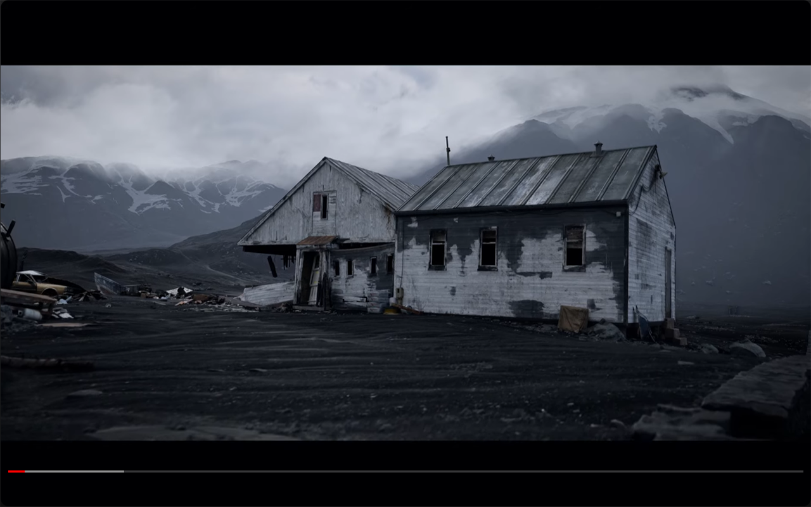
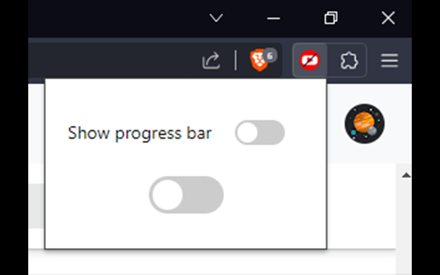

# Toogle Youtube Overlay

Toggle the visiblity of YouTube video overlays, including media buttons, progress bar, title and more...

## Usage

Press 'h' to toggle the visibility of overlay elements, excluding the progress bar. 
Alternatively, press 'p' to toggle the visibility of the progress bar. 

You can also use the UI buttons in the extension popup for these actions.

## Install

